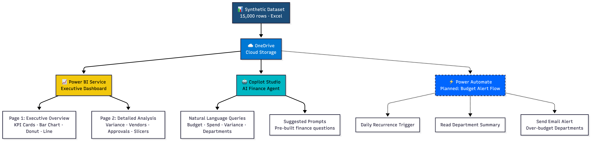
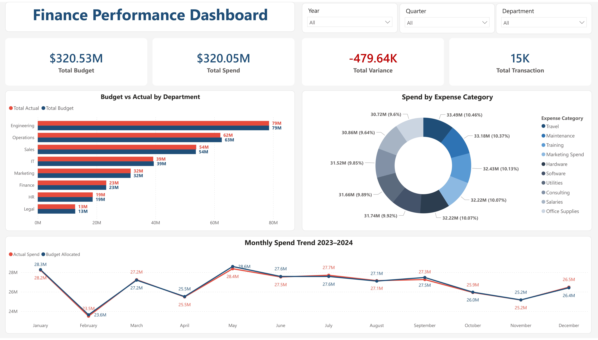

# Smart Finance Dashboard & AI Query Agent

> An end-to-end digital finance automation project built with Microsoft Power Platform and Copilot Studio — transforming manual corporate finance reporting into an automated, AI-powered system.

---

## Table of Contents

- [Project Overview](#project-overview)
- [Project Architecture](#project-architecture)
- [Tools & Technologies](#tools--technologies)
- [Features](#features)
- [Dashboard Preview](#dashboard-preview)
- [Dataset](#dataset)
- [How It Works](#how-it-works)
- [AI Agent Demo](#ai-agent-demo)
- [Automation Flow](#automation-flow)
- [Limitations](#limitations)
- [Key Insights](#key-insights)
- [Skills Demonstrated](#skills-demonstrated)


---

## Project Overview

In most finance teams, reporting is a manual process — data is copy-pasted into Excel, reports are built from scratch every month, and answering basic questions like *"which department is over budget?"* requires digging through spreadsheets.

This project replaces that manual workflow with a fully automated, AI-powered finance reporting system:

- **15,000-row synthetic corporate finance dataset** simulating real budget and expense data across 8 departments over 2 years
- **Interactive Power BI Dashboard** with 2 pages, real-time slicers, and 6 chart types
- **AI Finance Agent** built in Microsoft Copilot Studio that answers natural language questions about the data
- **( Planned )Automated Budget Alert Flow** in Power Automate that triggers daily email notifications for over-budget departments

---

## Project Architecture



---

## Tools & Technologies

| Tool | Purpose | Type |
|---|---|---|
| Microsoft Excel / OneDrive | Data storage and source | Cloud |
| Power BI Service | Interactive dashboard and reporting | Low-code |
| Microsoft Copilot Studio | AI chatbot agent for finance queries | Low-code / AI |

---

## Features

**Power BI Dashboard — Page 1 (Executive Overview)**
- 4 KPI cards: Total Budget, Total Spend, Total Variance, Total Transactions
- Budget vs Actual clustered bar chart by department
- Monthly Spend Trend line chart (2023–2024)
- Spend by Expense Category donut chart
- Year, Department, and Quarter slicers — all visuals filter simultaneously

**Power BI Dashboard — Page 2 (Detailed Analysis)**
- Variance % by Department column chart with conditional coloring (red = over budget, blue = under budget)
- Top Vendors by Spend table
- Transactions by Approval Status bar chart
- Year, Department, and Quarter slicers

**AI Finance Agent (Copilot Studio)**
- Answers natural language questions about the finance data
- Identifies over-budget departments with exact variance figures
- Powered by GPT-5 Chat model
- Connected to Excel knowledge base
- Pre-built suggested prompts for common finance queries

**(Planned for Future)Power Automate Budget Alert**
- Daily scheduled trigger
- Reads Department Summary data from Excel
- Sends automated email alert listing over-budget departments
- *(Note: Full Excel connector integration blocked by university DLP policy — see Limitations)*

---

## Dashboard Preview

### Page 1 — Executive Overview


### Page 2 — Detailed Analysis


### AI Agent in Action


---

## Dataset

The synthetic dataset was generated using Python (pandas + openpyxl) and contains **15,000 transaction rows** across 3 sheets:

**Sheet 1 — Transactions (15,000 rows × 20 columns)**

| Column | Description |
|---|---|
| Transaction_ID | Unique identifier (TXN-000001) |
| Date | Transaction date (2023–2024) |
| Year / Month / Quarter | Time dimensions |
| Department | One of 8 departments |
| Cost_Center | Department sub-unit |
| Expense_Category | Type of spend (Travel, Software, etc.) |
| Vendor | External vendor name |
| Budget_Allocated | Planned budget for transaction |
| Actual_Spend | Real spend amount |
| Variance | Actual minus Budget |
| Variance_Pct | Variance as percentage |
| Status | Approved / Pending / Rejected / Under Review |
| Approver | Manager name |
| Payment_Method | Bank Transfer / Credit Card / PO / Direct Debit |
| Currency | USD / EUR / GBP |
| Invoice_Number | Invoice reference |
| PO_Number | Purchase order (N/A for small expenses) |

**Sheet 2 — Monthly Summary:** Budget vs Actuals aggregated by month and department

**Sheet 3 — Department Summary:** High-level KPIs per department including total variance and transaction count

**Key Statistics:**
- Total Budget: **$320.53M**
- Total Actual Spend: **$320.05M**
- Total Variance: **-$479.64K**
- Total Transactions: **15,000**
- Date Range: January 2023 — December 2024
- Departments: Engineering, Sales, Marketing, Operations, Finance, HR, IT, Legal

---

## How It Works

**1. Data Layer**
A synthetic corporate finance dataset is generated in Python simulating realistic budget allocations, actual spend, and variance across 8 departments over 2 years. The data is stored in Excel on OneDrive as the single source of truth.

**2. Reporting Layer**
Power BI Service connects directly to the OneDrive Excel file. The dashboard auto-refreshes whenever the data changes, replacing a manual monthly reporting process. Interactive slicers allow filtering by Year, Department, and Quarter — all visuals update simultaneously.

**3. AI Layer**
A Copilot Studio agent is configured with the finance dataset as its knowledge source. Users ask natural language questions and receive instant, accurate answers with exact figures — eliminating the need to search through spreadsheets manually.

**4. Automation Layer**
Power Automate runs a daily scheduled flow that reads the Department Summary sheet, checks for over-budget departments, and sends an automated email alert to the finance team.

---

## AI Agent Demo

Example questions the Finance Agent can answer:

```
User: Which departments are over budget?

Agent: Based on the latest consolidated financial data, the departments 
currently over budget are:

• HR: Overspent by approximately $47,993 (about 26% over)
• Sales: Overspent by about $130,341 (around 24% over)
• Finance dept: Overspent by $22,989 (roughly 10% over)
• Marketing: Overspent by $41,029 (around 13% over)

Engineering, IT, Operations, and Legal remain within or under budget.
Would you like a detailed variance report?
```

---

## Automation Flow

The Power Automate Budget Alert Flow consists of 3 steps:

```
[Recurrence Trigger — Daily]
         ↓
[List rows from Excel — Department Summary]
         ↓
[Send Email (V2) — Budget Alert with live data]
```

The flow runs every 24 hours and sends a structured email listing all departments with a positive variance (over budget), enabling proactive financial management without manual monitoring.

---

## Limitations

**1. Power Automate — DLP Policy Restriction**

Full Excel-to-email automation was blocked by the university's Data Loss Prevention (DLP) policy (`Policy 19:23:30 10-31-2017`), which restricts the use of the `shared_office365` connector with `shared_excelonlinebusiness` in the same flow. This is a common enterprise security constraint in Microsoft 365 environments.

In a real corporate environment (such as Siemens Energy), this policy would either be configured to allow the connectors or a Premium connector with proper permissions would be used.

**2. Static Knowledge Base**

The Copilot Studio agent uses a snapshot of the dataset as its knowledge source. In a production environment, this would be connected to a live database or API for real-time querying.

**3. Synthetic Data**

All data is simulated using Python for demonstration purposes. No real financial data was used.

---

## Key Insights

From the dashboard analysis:

- **Sales** is the most over-budget department at 24% above allocation — highest absolute overspend at $130K
- **Engineering** has the highest total spend at $79M but remains within budget
- **Approved transactions** account for ~50% of all transactions (7,550 out of 15,000)
- **Travel and Maintenance** are the top expense categories by volume
- Spend remains relatively stable month-over-month with a slight downward trend in late 2024

---

## Skills Demonstrated

- Process analysis and digitalization of manual finance workflows
- Low-code development with Microsoft Power Platform
- AI agent design and configuration with Microsoft Copilot Studio
- Data analysis and visualization with Power BI
- Workflow automation with Power Automate
- Corporate finance concepts: budget vs actuals, variance analysis, expense categorization

---

## Future Enhancements

- **Budget Alert Automation** — Complete the Power Automate flow 
  once DLP policy restrictions are resolved. The flow is designed 
  to run daily, read live Excel data, and send automated email 
  alerts when any department exceeds its budget threshold.

- **Live Data Connection** — Replace the static Excel file with 
  a live database (Azure SQL or Dataverse) for real-time dashboard 
  refresh and AI agent queries.

- **Copilot Studio + Teams Integration** — Deploy the Finance Agent 
  directly inside Microsoft Teams so finance team members can query 
  budget data without leaving their workflow.

- **Expanded AI Agent** — Train the agent on historical trend data 
  to provide forecasting answers like "at current burn rate, when 
  will Engineering exhaust its Q3 budget?"


